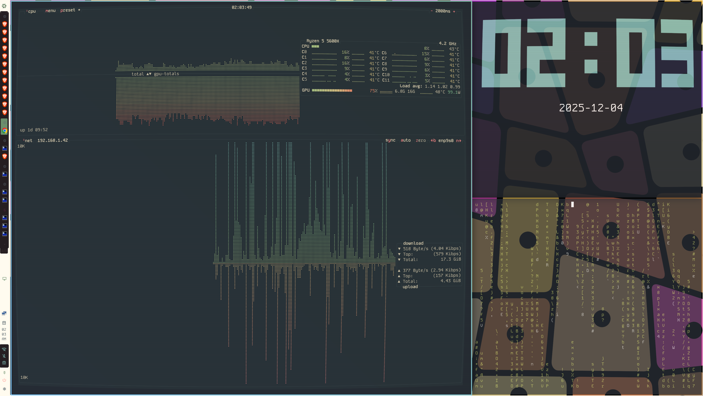

# Sitka Shell

Sitka Shell is a Niri-first desktop shell built with
[Quickshell](https://github.com/quickshell/quickshell). It began as a fork of
[Niri Caelestia Shell](https://github.com/0lxy/niri-caelestia-shell) and
[Caelestia Shell](https://github.com/caelestia-shell/caelestia-shell), but its
configuration, window-manager integration, visual language, and service layer
have diverged substantially.



## Features

- Left-side bar with workspaces, tray, coding-agent quotas, status, clock, and configurable entries
- Launcher with application, command, calculator, and wallpaper search
- Dashboard, control center, notifications, OSDs, session menu, and lock screen
- Niri window/workspace models with measured state and polling diagnostics
- Wallpaper browsing, audio visualization, and optional shader effects
- JSON configuration and a Home Manager module

## Status

Sitka Shell is an experimental personal shell rather than a polished desktop
distribution. Niri is the primary target. Some Hyprland paths remain, but they
are best-effort and are not kept at feature parity.

See [TODO.md](TODO.md) for the current maintenance roadmap.

## Install

### Nix

Run the current package directly:

```sh
nix run github:bigFin/sitka-shell
```

On non-NixOS systems, use the `arch` output so the application is wrapped with
`nixGL`:

```sh
nix run github:bigFin/sitka-shell#arch --impure
```

### Home Manager

Add the flake and import its module in your Home Manager configuration:

```nix
{
  inputs.sitka-shell.url = "github:bigFin/sitka-shell";

  # In the relevant Home Manager module:
  imports = [inputs.sitka-shell.homeManagerModules.default];

  programs.sitka = {
    enable = true;
    settings = {
      general.theme = "EverforestDark";
      bar.revealMode = "corner";
    };
  };
}
```

The module installs the shell, writes `~/.config/sitka/shell.json`, and can run
Sitka Shell as a user service.

## Development

Clone the repository and enter the development shell:

```sh
git clone https://github.com/bigFin/sitka-shell.git
cd sitka-shell
nix develop
```

Run the current checkout instead of the packaged source:

```sh
qs -p .
```

Build the package before submitting changes:

```sh
nix build .#sitka-shell
```

## Configuration

Runtime configuration belongs outside the repository:

```text
~/.config/sitka/shell.json
```

Start from the annotated example:

```sh
mkdir -p ~/.config/sitka
cp config/shell.json.example ~/.config/sitka/shell.json
```

The repository intentionally ignores `config/shell.json` and
`config/shell.json.backup` so local preferences do not become source files.

Useful environment overrides:

| Variable | Purpose |
| --- | --- |
| `SITKA_CONFIG_DIR` | Override the configuration directory |
| `SITKA_WALLPAPERS_DIR` | Override the wallpaper directory |
| `SITKA_LIB_DIR` | Locate Sitka helper libraries |

### Themes and transparency

Built-in themes are `EverforestDark`, `EverforestLight`, and `RosePine`.
Theme selection is declarative:

```json
{
  "general": {
    "theme": "EverforestDark"
  },
  "appearance": {
    "transparency": {
      "mode": "opaque",
      "enabled": false,
      "base": 0.58,
      "layers": 0.24,
      "scrim": 0.5
    }
  }
}
```

Transparency modes:

- `opaque`: disable shell surface alpha
- `normal`: use `enabled`, `base`, `layers`, and `scrim`
- `transparent`: force the lower-alpha rice-oriented defaults

Leave shader effects and the background visualizer disabled unless they are in
active use; both add continuous rendering or audio work.

## Running and IPC

Start a packaged shell:

```sh
sitka-shell
```

Niri startup example:

```kdl
spawn-at-startup "sitka-shell"
```

Inspect and call IPC targets with the stable package wrapper:

```sh
sitka-ipc show
sitka-ipc call drawers toggle launcher
sitka-ipc call lock lock
sitka-ipc call stateStats get
sitka-ipc call stateStats mark
sitka-ipc call stateStats delta
```

When running directly from a checkout, use Quickshell:

```sh
qs -p . ipc show
qs -p . ipc call drawers toggle launcher
```

## Runtime integrations

The Nix package supplies the shell's main runtime dependencies. Features also
expect the corresponding system services or tools to exist:

- NetworkManager for network state
- PipeWire, libcava, and aubio for audio visualization
- `brightnessctl` or `ddcutil` for brightness controls
- `grim` and `swappy` for screenshots
- `lm-sensors` and supported GPU tools for hardware metrics
- Material Symbols and a Nerd Font for icons and glyphs
- Codex CLI for Codex quota data; Claude Code plus `script`/`timeout` for Claude quota data

The dashboard profile image is read from `~/.face`. Wallpapers default to
`~/Pictures/Wallpapers`.

## Credits

- [Caelestia Shell](https://github.com/caelestia-shell/caelestia-shell)
- [Niri Caelestia Shell](https://github.com/0lxy/niri-caelestia-shell)
- [Quickshell](https://github.com/quickshell/quickshell)
- [Niri](https://github.com/YaLTeR/niri)
- All upstream and Sitka Shell contributors
